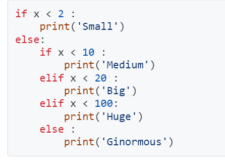
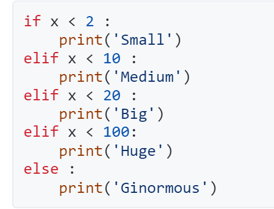
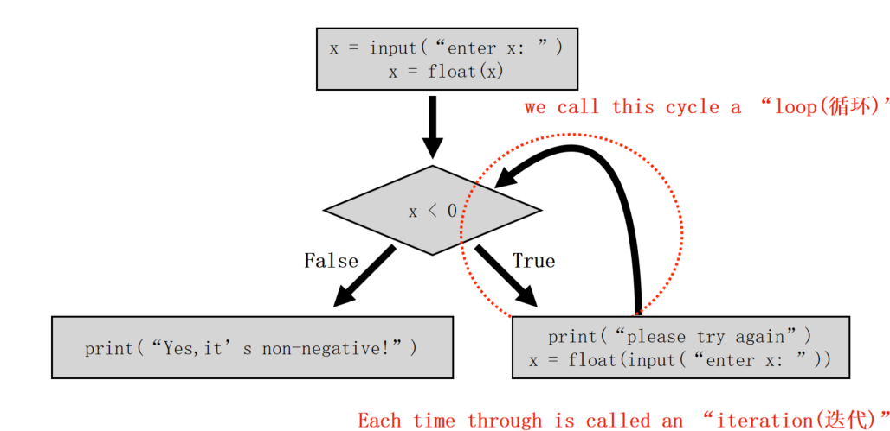
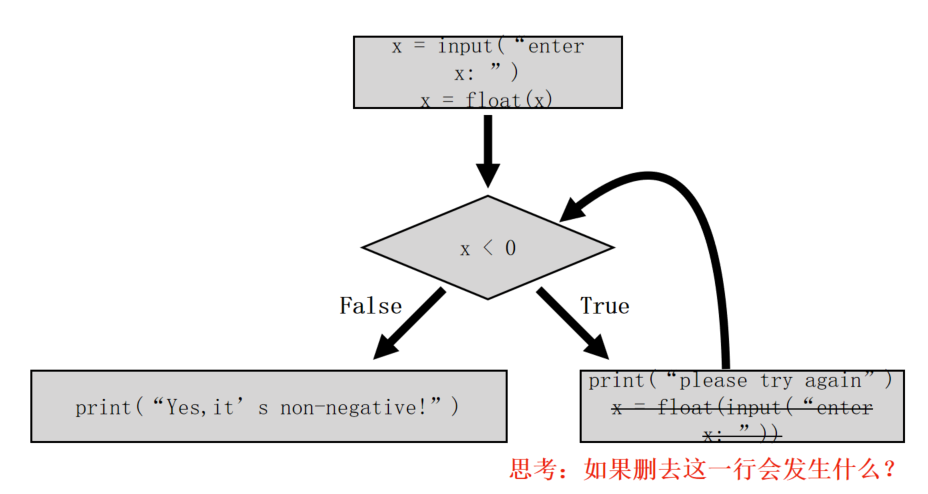
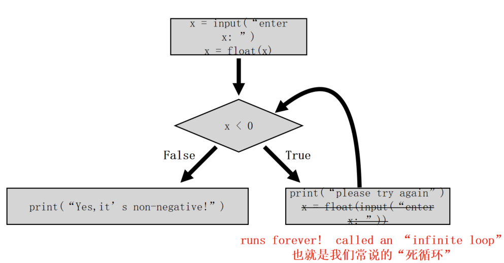
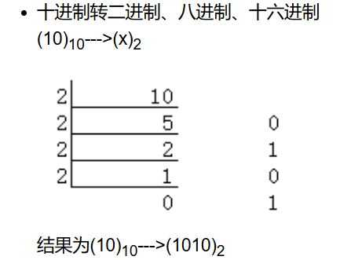
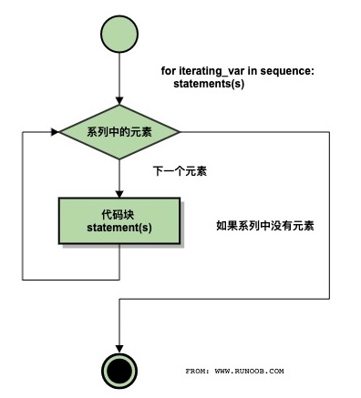

# 控制流(Control Flow)——条件判断与循环

---

# 目录

* **条件语句**

* **列表，元组与字典**

* **循环语句**

* **列表推导式**

---

## 控制流(Control Flow)到底是什么？

* 控制流是指在一个程序中，决定程序执行顺序的过程。

* 控制流是通过使用**条件语句**（如if-else）和**循环语句**（如for、while）来实现的。

---

# 条件语句

---

## 条件语句

* 在Python中，我们使用 **if，elif** 和 **else** 关键字来编写条件语句。

---

## if 语句

if语句的基本语法如下：

```python
if condition: 
    statement
```

这里的condition是一个布尔表达式，如果其值为True，那么statement会被执行,例如：

```python
x = 10
if x > 0:
    print("x is a positive number")
```

在这个例子中，如果x大于0，那么就会打印出 "x is a positive number"

---

## if 语句

```python
x = 10
if x > 0:
    print("x is a positive number")
```

* 在这个例子中，如果x大于0，那么就会打印出 "x is a positive number"


---


## if-else 语句

if-else语句的基本语法如下：

```python
if condition:
    statement1
else:
    statement2
```

如果condition为True，那么执行statement1，否则执行statement2。例如：

```python
x = -10
if x > 0:
    print("x is a positive number")
else:
    print("x is not a positive number")
```

在这个例子中，因为x不大于0，所以会打印出 "x is not a positive number"

---

## if-else 语句

```python
x = -10
if x > 0:
    print("x is a positive number")
else:
    print("x is not a positive number")
```

* 在这个例子中，因为x不大于0，所以会打印出 "x is not a positive number"


---


## if-elif-else 语句

if-elif-else语句的基本语法如下：

```python
if condition1:
    statement1
elif condition2:
    statement2
else:
    statement3
```

**这里可以有多个elif部分**，每个elif后面都跟着一个条件和相应的语句。如果condition1为True，执行statement1；否则，检查condition2，如果为True，执行statement2；如果所有的条件都不为True，执行statement3.

---

## if-elif-else 语句

```python
x = 0
if x > 0:
    print("x is a positive number")
elif x < 0:
    print("x is a negative number")
else:
    print("x is zero")
```

在这个例子中，因为 x 等于0，所以会打印出"x is zero".

---

## Nested if-statements 嵌套

* if、elif和else主体中的所有语句也可以是条件语句


---

## Nested if-statements 嵌套

* if、elif和else主体中的所有语句也可以是条件语句，例如：

<center class="half">


</center>

---

## Nested if-statements 嵌套

* if、elif和else主体中的所有语句也可以是条件语句，例如：

 

---

## Example：写一个funtion判断是否能登机

```python
def fly():
    ticket = int(input("是否购买机票（0-未购买 1-购买）"))
    safety = int(input("是否通过安检（0-未通过 1-通过）"))
    
    if ticket == 1 and safety == 1:
        print("请登机")
    elif ticket == 1 and safety != 1:
        print("未通过安检，不能登机")
    else:
        print("没有机票不能登机")
```

---

# 列表，元组与字典

* 列表、元组和字典是Python中常用的数据结构，它们各自有不同的特点和使用场景

---

## List（列表）

* construct(构造) : li = [1, 2, 3]

  * 元素之间用逗号分隔

* visit(访问) : li[index]

  * **与字符串的索引一样，列表索引从0开始**

* change(改变): li[index] = ...

* slide(切片): li[from:to:step]

* length(长度)

  * len(li) 获取列表中元素个数

* operator运算符

  * '+' 可以连接两个list

---

## List

### Methods

* append $~~~~~~~$li.append(item) $~~~~~~~~~~~~~~~~$结尾追加一个元素
* insert $~~~~~~~~~~$li.insert(index, item) $~~~~~~~~~$在指定位置插入一个元素
* remove $~~~~~~~$li.remove(item) $~~~~~~~~~~~~~~~~$删除指定值的元素
* pop $~~~~~~~~~~~$ item = li.pop(index) $~~~~~~~~~$删除指定位置的元素, 并返回删除的元素的值
* index $~~~~~~~~~$ obj = li.index(item) $~~~~~~~~~$从列表中找出某个值第一个匹配项的索引位置
* sort $~~~~~~~~~~~$ li.sort() $~~~~~~~~~~~~~~~~~~~~~~~~~~~~~$排序，默认从小到大
* reverse$~~~~~~~$ li.reverse() $~~~~~~~~~~~~~~~~~~~~~~~~$将列表反向

---

## List

### Nested list 嵌套列表

* 我们可以在list中嵌套其他list

* matrix = [[1, 2, 3], [4, 5, 6]] (二维列表)

---

## Tuple（元组）

* Python 的元组与列表类似，**不同之处在于元组的元素不能修改**。

* 元组使用小括号，列表使用方括号。

* 元组创建很简单，只需要在括号中添加元素，并使用逗号隔开即可。

```python
tup1 = ('physics', 'chemistry', 1997, 2000)
tup2 = (1, 2, 3, 4, 5 )
tup3 = (50,) #元组中只包含一个元素时，需要在元素后面添加逗号
```

* 访问方法和list相同，只是元组中的元素值是不允许修改的。

---

## Set（集合）

* 集合（set）是一个无序的不重复元素序列。

* 集合中的元素不会重复，并且可以进行交集、并集、差集等常见的集合操作

* 可以使用大括号 { } 创建集合，元素之间用逗号 , 分隔， 或者也可以使用 set() 函数创建集合

```python
set1 = {1, 2, 3, 4}            # 直接使用大括号创建集合
set2 = set([4, 5, 6, 7])      # 使用 set() 函数从列表创建集合
```

---

## Dict（字典）

* 字典的每个键值 **key:value** 对用冒号 : 分割，每个键值对之间用逗号 , 分割，整个字典包括在花括号 {} 中 ,格式如下所示：

```python
d = {key1 : value1, key2 : value2 }
```

* 键一般是唯一的、不可变的，如果重复最后的一个键值对会替换前面的，值不需要唯一。

```python
tinydict = {'Alice': '2341', 'Beth': '9102', 'Cecil': '3258'}
```

* 其中``Alice,Beth,Cecil``是``key``，``2341,9102,3258``是``value``,
形如``Alice:2341``的我们称之为**键值对** (key-value pairs)

---

## Dict（字典）

* construct(构造): di = {‘1’: 1, ‘2’: 2, ‘3’: 3}

* visit(访问): print(di[‘1’])

* change(改变): di[‘1’] = 100

* delete(删除): del di[‘1’]

---

## Example

```python
>>> tinydict = {'a': 1, 'b': 2, 'b': '3'}
>>> tinydict['b']
'3'
>>> tinydict
{'a': 1, 'b': '3'}
```

---

## 区分python中的四种集合数据类型（列表，元组，集合，字典）

1. 列表（List）：有序，可更改，可以有重复的成员

2. 元组（tuple）：有序，不可更改，可以有重复的成员

3. 集合（set）：无序，无索引，没有重复的成员。

4. 字典 （Dictionary）：无序，可更改，有索引，没有重复的成员

---

# 循环语句

* 简单来说，循环语句就是让代码反复执行某个操作，直到满足某个条件为止。
* 在Python中，最常用的循环语句就是for和while

---

## While 循环

```python
while condition：
    statements
```

* 判断条件(condition)可以是任何表达式，任何非零、或非空（null）的值均为true
* 当判断条件为 false 时，循环结束，否则一直循环


---

## While 循环

* example

```python
x = input("enter x")
x = float(x)
while x < 0:
    print("please try again")
    x = float(input("enter x"))
print("Yes,it's non-negative!")
```

---

## While 循环


---

## While 循环



---

## While 循环



* **To avoid infinite loops, make sure something will/can eventually happen in the body to change the condition.**

---

## While 循环

* **break 与 continue**

* 如果使用 break 语句，即使 while 条件为真，我们也可以停止循环

```python
i = 1
while i < 7:
    print(i)
     if i == 3:
        break
    print(i)
    i += 1
```

---

## While 循环

* **break 与 continue**

* 如果使用 continue 语句，我们可以停止当前的迭代，并继续下一个：

```python
i = 0
while i < 7:
    i += 1 
    if i == 3:
        continue
    print(i)
```

---

## Example：进制转换

* 我们尝试将一个十进制数转换为一个二进制数

* 思考一下：我们如何要将十进制的数字10转换为二进制？

---

## Example：进制转换

* 我们尝试将一个十进制数转换为一个二进制数

* 思考一下：我们如何要将十进制的数字10转换为二进制？

* 有很多种方法，我们这里介绍一种方法：**短除法**

* 短除法运算方法是先用一个除数除以能被它除尽的一个质数，以此类推，除到商是质数为止。

---

## 短除法

* 短除法运算方法是先用一个除数除以能被它除尽的一个质数，以此类推，除到商是质数为止。



---

## Example：进制转换

* 在这样的灵感下，我们尝试用while循环去实现这一过程

```python
def decimal_to_binary(n):  
    binary_num = ''  
    while n > 0:  
        remainder = n % 2  
        binary_num = str(remainder) + binary_num  
        n = n // 2  
    return binary_num  
# 示例  
decimal_number = 10  
binary_number = decimal_to_binary(decimal_number)  
print(f"十进制数 {decimal_number} 转换为二进制数是: {binary_number}")
```

* 请注意：这里最后的**binary_num**事实上是**string**类型的

---

## For 循环

* for循环可以遍历任何序列的项目，如一个列表或者一个字符串

```python
for iterating_var in sequence:
   statement(s)
```



---

## For 循环

### Example1：遍历列表

```python
for i in [5, 4, 3, 2, 1]: # (a five-element sequence)
print(i)
# 在这种情况下，the iteration（即i）有序地接受列表[5,4,3,2,1]中的元素
# 首先 i = 5，并且print出来
# 然后 i = 4, print...以此类推，直到i = 1 然后再 print
# 在那之后，列表中的所有元素都被遍历，循环结束
```

---

### Example2：遍历字典

```python
dic = {'name':'teafrogsf','age':22,'gender':'male'}
for k in dic:  # for 循环默认取的是字典的key赋值给变量名k
    print(k,dic[k])
# name teafrogsf
# age 22
# gender male
```

---

### Example3

```python
li = [1, 3, 5, 7, 9, 11]
for i in li: # It's dangerous to modify a list when you're iterating it.
if i == 5:
    li.remove(i)
print(i, end=' ')
```

Output:

```python
1 3 5 9 11
```

* **在迭代一个列表时，修改它是很危险的！！！**

---

## Nested for statement 循环嵌套

```python
for variable in sequence:
    outer_loop_statement_1
    outer_loop_statement_2
    …
    for variable in sequence:
        inner_loop_statement_1
            …
        inner_loop_statement_N
    outer_loop_statement_N
statements_after_all_for_loops
```

---

### Example4

```python
for i in [1, 2, 3]:
    for j in [1, 2, 3]:
        print(i * j, end=' ')
    print()
print('Bingo')
```

Output:

```python
1 2 3
2 4 6
3 6 9
Bingo
```

---

## for循环控制循环次数：**range()**

* Type **range** 表示不可变的数字序列，通常用于循环中的特定次数

```python
range(start, stop, step)
```

* 计数从start开始(**包含start**)，到stop结束(**不包含stop**)，step表示步长（**默认为1**）

```python
>>> range(10)
range(0, 10)
>>> type(range(0, 10))
<class 'range'>
>>> list(range(4))
[0, 1, 2, 3]                        # range(m) range from zero to m-1
>>> list(range(3, 9))
[3, 4, 5, 6, 7, 8]                  # range(x, y) range from x to y-1
>>> list(range(3, 9, 2))
[3, 5, 7]
>>> list(range(7, 2, -1))           # range(x,y,-1) range form x to y+1
[7, 6, 5, 4, 3]
# range(x, y, step_size)
>>> list(range(4, 1))
[]                                  # if x>y, it will be an empty object
```

---

### Example of the range type

```python
for i in range(1, 11):
    if i % 2 == 0:
        print(f'{i:2}: even')
    else:
        print(f'{i:2}: odd')
```

Output:

```python
1: odd
2: even
3: odd
4: even
5: odd
6: even
7: odd
8: even
9: odd
10: even
```

---

### Find the maximum value in a sequence 找最大值

```python
largest_so_far = -1
li = [3, 5, 4, 7, 9, 2]
for i in li:
    if i > largest_so_far:
        largest_so_far = i
print(largest_so_far)
```

Output

```python
9
```

---

### Judge prime number 判断是否是质数

```python
num = 17
is_prime = True
for i in range(2, num):
    if num % i == 0:
        is_prime = False
print(is_prime)
```

Output:

```python
True
```

---

### Iterate through a dictionary by its keys 按键(key)遍历字典

* Method 1: 直接遍历key

```python
# iterate through keys directly
a_dict = {'name' : 'lyx', 'age' : 18, 'address' : 'ShangHai'}
for key in a_dict:
    print(key, ":", a_dict[key])
```

* Method 2: 使用``.keys()`` 函数 create a list of the keys

```python
# iterate through a list made up of keys
a_dict = {'name' : 'lyx', 'age' : 18, 'address' : 'ShangHai'}
for key in a_dict.keys():
    print(key, ":", a_dict[key])
```

Output:

```python
name : lyx
age : 18
address : ShangHai
```

---

### Iterate through a dictionary by its value 按值遍历字典

* 使用``.values()``函数create a list made up of its values

```python
a_dict = {'name' : 'lyx', 'age' : 18, 'address' : 'ShangHai'}
for val in a_dict.values():
    print(val)
# Note that we can't find a key through a value, since that different keys may have the same value.
```

Output:

```python
lyx
18
ShangHai
```

* **Warning : 用value去查找对应的key是不可行的**

---

### Iterate through a dictionary by both its key and corresponding value 

### 通过键值对去遍历字典

* 使用``.item()``函数create a list made up of  key-value pairs（键值对）

```python
a_dict = {'name': 'lyx', 'age': 18, 'address': 'ShangHai'}
for key, val in a_dict.items():
    print(key, ":", val)
```

Output:

```python
name : lyx
age : 18
address : ShangHai
```

---

## for循环的跳出

* for+break: 同while循环一样，只要运行到break就会立刻中止本层循环

---

# 列表推导式(List Comprehensions)

---

## List Comprehensions 列表推导式

* 列表推导式是一个用于生成新列表的表达式，其基本形式如下：

```python
[expression for item in iterable]
```

* 这里，``expression`` 是基于 ``item``的某种表达式，``iterable`` 是任何可以遍历的对象。

---

### Example :创建一个包含前10个正整数平方的列表

```python
squares = [x**2 for x in range(1, 11)]
print(squares)
```

Output:

```python
[1, 4, 9, 16, 25, 36, 49, 64, 81, 100]
```

---

### 列表推导式中的条件过滤

* 列表推导式还可以包含一个可选的条件子句，用于过滤出满足特定条件的项。其形式如下：

```python
[expression for item in iterable if condition]
```

* 在先前的例子中，如果我们只要偶数的平方，可以这样做：

```python
squares_of_evens = [x**2 for x in range(1, 11) if x % 2 == 0]
print(squares_of_evens)
```

Output:

```python
[4, 16, 36, 64, 100]
```

---

### 嵌套的列表推导式

* 列表推导式可以嵌套使用，即在一个列表推导式中包含另一个列表推导式。这在处理多维数据时非常有用。

* Example：我们有一个二维列表（即列表的列表），并想要将其扁平化为一个一维列表。可以使用嵌套的列表推导式：

```python
nested_list = [[1, 2, 3], [4, 5, 6], [7, 8, 9]]
flattened_list = [x for sublist in nested_list for x in sublist]
print(flattened_list)
```

Output:

```python
[1, 2, 3, 4, 5, 6, 7, 8, 9]
```

* 这里，外部的列表推导式遍历 nested_list 的每一个子列表，内部的列表推导式则遍历每个子列表的元素

---

## 列表推导式

* 总的来说，Python 的列表推导式是一种非常强大的工具，可以使我们的代码更简洁、更直观。
* 但是，需要注意的是，当列表推导式变得过于复杂时，可能会使代码的可读性降低。在这种情况下，可能需要考虑使用传统的循环结构或函数来替代。

---

# Summary

本节课我们学习了：

* 条件语句
  * if-elif-else 语句
  * Nested if-statements
* List,tuple and dict的概念和简单操作
* 循环语句
  * While 循环
  * For 循环
* 列表推导式基础

---

# Thanks for your listening!

