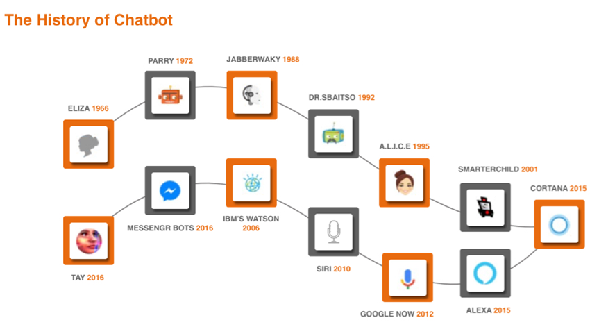
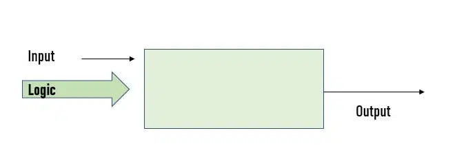

# 计算世界的奇妙——算法，这也是人工智能？
## Lecture 7

---

## 众所周知在故事的开始之前要有一个引子

* 今天我们引子的主角是——聊天机器人（Chatbot）！

---

## Chatbot是什么？

不陌生对吧？

* Siri
* 小爱同学
* 以及ChatGPT
* ...

---

## Chatbot的起源：ELIZA

* 第一个聊天机器人！
* 1966年诞生，已经58岁了
* 使用模式匹配和替换方法来模拟对话（看不懂也没关系）
* 诞生最初的目的并不是当聊天机器人
* https://arxiv.org/pdf/2406.17650
* ELIZA的关键方法涉及认出输入里的提示字词，并且找出相关的、预先设定的回答，在显然有意义的方式下，让谈话继续下去（例如，输入里有“母亲”，回答是“多说一点你的家庭”）。

---

## Chatbot的起源：ELIZA

---

## Chatbot的发展：ALICE

* 摘抄自互联网：从20世纪60年代快进到90年代，第一个人们熟知的能在线交流的聊天机器人——ALICE出现了。（真的熟知吗）
* 但就像ELIZA一样，ALICE也是一个根据规则建构起来的计算机程序，接收输入并产出输出。不过，ALICE在以下三个方面优于ELIZA：

1. 它以一种被称为人工智能标记语言（AIML）的编程语言编写，也就是说它更抽象了
2. 它拥有成千上万种可能的回应
3. 它会存储之前与用户的对话，并将对话存储在数据库中

---

## Chatbot的发展：ALICE

* 通过互联网与真人聊天~~当时的互联网还是高科技~~
* Alice被定义为一位年轻的人类女性，她会告诉用户她的年龄、爱好和其他有趣的事实，并回答用户的对话。

---

## Chatbot的变迁

---

## Chatbot的现在：       ChatGPT   

* 2022年11月30日，它出生了
* 彼时还是算法与数据结构助教的我马上拿它来测试我出的算法题
* ~~发现它不会做我就放心了~~
* 简单来说，ChatGPT是一种**生成式人工智能**，回复的有可能是从未在语料库中出现的、由聊天机器人自己“创造”出来的句子
* 注意：ChatGPT $\neq$ GPT（后续的教学内容中我们会详细说明）

---

## 所以这个引入是想说什么？

你觉得哪个ChatBot是AI？

* ChatGPT肯定是AI
* ALICE是AI吗？
* ELIZA是AI吗？
* Siri是AI吗？小爱同学是AI吗？

在回答这个问题之前，因为引子已经结束了，让我们开始故事的第一章。~~就卖关子就卖关子~~

---

# Introduction to Introduction to AI 课程介绍

---

# 接下来，我们先...

---

## 从算法说起

* 为什么会说这个？
* 你理解的算法是什么？

---

## 举个栗子

如果大家玩过一些人物能右键点击走路的游戏，你会发现人物会沿着一条路径走到目标地点。

  

* 问题来了：游戏如何计算角色到指定地点的路线呢？

---

## 游戏设计入门

* 首先我们得对地图有一个基本的预期：它大概不是连续的二维平面
* 计算机的存储空间是有限的
* 那我们就把地图看成一个网格图好了

---

## 遍历太低效了，能不能优化一下？

* 如何相对高效地寻找到一条相对短的路径呢？

* 我们可以设置一个这样的方法：每次走一段距离，就从重新计算当前位置和目标位置之间的距离，然后再重新规划路线，尽量遵循两点之间线段最短的原则，这样是不是比穷举法好得多？

* 没错，这就是一个简单的算法

> An algorithm is a finite sequence of well-defined, computer-implementable instructions, typically to solve a class of problems or to perform a computation.

* 这是维基百科的定义，翻译过来就是**算法是一系列有限的、清晰定义的、可实现的计算机指令，并用以解决一类问题或进行计算**

---

### 算法是什么？

* **算法是为了解决特定问题而规定的一系列操作**

* 算法与函数类似，都能接受输入产生输出

---

* 事实上，算法有复杂有简单，有些快有些慢
* 优秀的算法能够在较短的时间内找到问题的解，或者在相同的时间内处理更多的数据。
* 算法研究者们更关注算法的**渐进时间复杂度**（Big O表示法），即随着问题规模的增长，算法执行时间或所需资源的增长趋势。这是因为在实际应用中，问题规模往往很大，而渐进时间复杂度能够反映算法在大规模问题上的性能表现。
* 算法的时间复杂度只是评判算法优劣的一个相对指标，在实际应用中，我们还需要考虑其他因素，如算法的具体实现细节、计算机硬件的性能、数据的实际分布等
* 因此，在实际应用中，我们通常会通过实验来测试算法在特定条件下的性能表现，并选择一个在大多数情况下都能表现良好的算法

---

## 说了这么多，算法与AI到底什么关系？

* 早期的人工智能大多是通过固定指令来执行特定的问题，并不具备真正的学习和思考能力
* **AI在很大程度上是算法设计的结果**

---

## 传统AI的典型：图灵机

* 图灵机由图灵于1936年提出的一种抽象的计算模型，即将人们使用纸笔进行数学运算的过程进行抽象，由一个虚拟的机器替代人类进行数学运算

* 图灵把这样的过程看作下列两种简单的动作：

1. 在纸上写上或擦除某个符号；
2. 读写头从纸的一个位置移动到另一个位置。

* 而在每个阶段，人要决定下一步的动作，依赖于 (1) 此人当前所关注的纸上某个位置的符号和(2) 此人当前思维的状态。

---

## AI在很大程度上是算法设计的结果

* 早期的AI其实就是人机，在人工设计的算法下能够简单的执行一些命令
* 那它就不是我们现在常说的AI吗？

---

## 传统AI与机器学习

### 传统AI
* 它需要一些输入和一些代码形式的逻辑，并为您提供输出

* 传统算法基于算法中描述的步骤产生输出。给出算法输入，它根据您自己硬编码的规则和参数生成输出。

---

## 传统AI与机器学习

### 机器学习

* 机器学习是一门关于数据学习的科学技术，它能帮助机器从现有的复杂数据中学习规律，以预测未来的行为结果和趋势。
* 例如：当我们在淘宝购物时，机器学习算法会根据我们的购买历史来推荐可能会喜欢的其他产品，以提升购买概率

---

## 机器学习的简单原理

* 假如我们正在教小朋友识字（一、二、三）。我们首先会拿出3张卡片，然后便让小朋友看卡片，一边说“一条横线的是一、两条横线的是二、三条横线的是三”。

* 不断重复上面的过程，小朋友的大脑就在不停的学习：

* 当重复的次数足够多时，小朋友就学会了一个新技能——认识汉字：一、二、三

---

## 机器学习的简单原理

* 我们用上面人类的学习过程来类比机器学习。机器学习跟上面提到的人类学习过程很相似。

* 认字的卡片在机器学习中叫——训练集(training set)

* “一条横线，两条横线”这种区分不同汉字的属性叫——特征(feature)

* 学会了识字后总结出来的规律叫——模型(model)

* 通过训练集，不断识别特征，不断建模，最后形成有效的模型，这个过程就叫“机器学习”

---
## 机器学习

* 需要输入和输出，并会根据输入和输出生成一些逻辑，然后可以使用这个新逻辑来处理新输入以提供输出。

* ML算法基于通过提供给它的输入进行学习来预测输出。通过输入进行的学习称为训练过程。

* 给出要学习的算法数据，并调整参数来解释数据。然后可以使用这些参数集来解释/预测新数据
