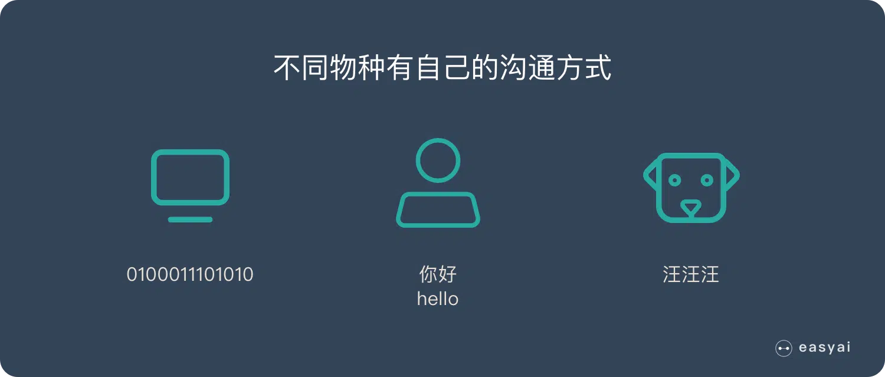
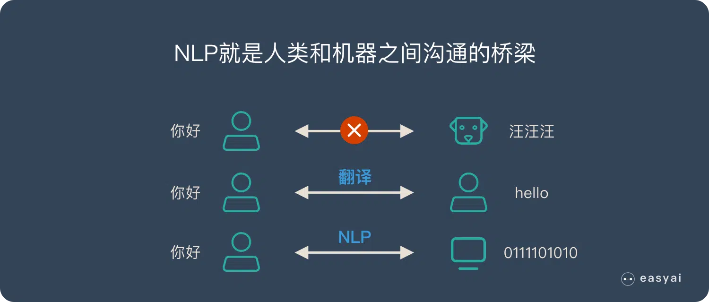
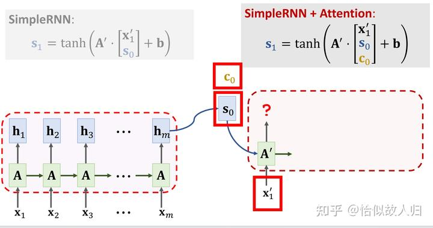
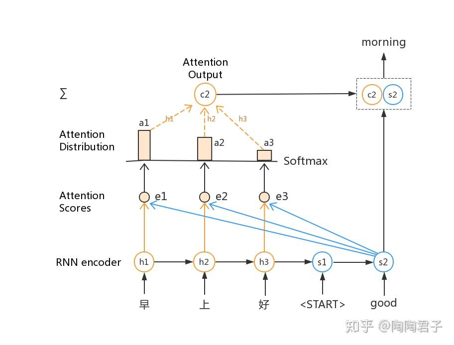

# Intro: ChatGPT 的诞生

<!--v-->

## ChatGPT

- ChatGPT: Chat Generative Pre-trained Transformer
- 2022 年 11 月 30 日，ChatGPT 横空出世，短短5天，注册用户数就超过100万。
- 2023 年一月末，ChatGPT的月活用户已突破1亿，成为史上增长最快的消费者应用。
- 笔者当时拿它做疫情期间的英语试卷，比我分还高 /TwT/
- 引发了一火车 **新闻学乱象**

<!--s-->

# AI 的两大流派 - NLP VS CV

<!--v-->

## 自然语言处理（NLP, Natural Language Processing）

- 顾名思义：NLP，就是让机器理解自然语言（也就是人类的文化载体——文字），然后让机器处理，运用人类语言

- 早在人工智能兴起之前，NLP就是计算机科学的重要研究方向之一。我们很多熟知的技术，如搜索引擎、机器翻译，Chatbot等，都是NLP的应用。

- NLP的目标是让计算机能够像人类一样理解和处理自然语言，从而实现更智能的人机交互。

- 这只是一个简介，后面会更加深入地介绍NLP

<!-- FIXME: 

Reference: 
Google
from
PBMT(phrase-based machine translation) 
to
GNMT(Google Neural Machine Translation)
-->

<!--v-->

## 计算机视觉（CV, Computer Vision）

### 让计算机能够像人类一样理解和解析视觉世界

人类能够轻易地理解和描述图像中的场景。以下图为例，人类能做到的不仅仅是检测到图像前景中有四个人（可能是五个）和一面美国国旗

除了这些基本信息，人类还能够看出图像中的人物动作和神态，其中一人挥拳呐喊，我们甚至知道他是谁。我们可以理性地推断出图中人物一被击中了。人类还可以描述图中人物的穿着，不止是衣服颜色，还有材质与纹理。

这也是计算机视觉系统需要的技能。简单来说，计算机视觉解决的主要问题是：

- 给出一张二维图像，计算机视觉系统必须识别出图像中的对象及其特征，如形状、纹理、颜色、大小、空间排列等，从而尽可能完整地描述该图像。

- 刚刚我们在观察图片时，人眼和大脑事实上已经完成了一系列任务
- 这些任务就对应了 CV 中的几个主要任务
    - 图像分类（Image Classification）： 识别图像所属的类别，比如图中你研究能看出人和国旗的区别。
    - 人脸识别（Face Recognition）： 识别并确认图像或视频中的人脸，比如你一眼丁真，认出了川普。
    - 目标检测/追踪（Object Detection&Tracking）： 找出图像中的目标及其位置（假设这是一个视频，想必你会全神贯注地盯着Trump看）
    - 语义分割（Semantic Segmentation）： 将图像划分为具有不同语义的区域（在观察这张图片时，你已经自动地确定了每个角色的边界，你当然知道那只伸出的手臂是川普的而不是他保镖的）

<!-- ## 其他流派

- 语音识别: 将口语转换为书面文本
    - 任务: 语音转文本、语音分析、语音生成
    - 应用: 语音助手、自动翻译电话、无障碍沟通技术
- 强化学习: 关注如何通过奖励和惩罚机制指导代理（agent）学习策略。
    - 任务: 策略优化、环境交互、奖励机制设计
    - 应用: 游戏AI、机器人控制、自动化交易系统
- 生成对抗网络（Generative Adversarial Networks, GANs）: 由生成器和判别器组成的模型框架，用于生成接近真实数据的假数据。
    - 任务： 图像生成、图像超分辨率、数据增强。
    - 应用： 图像合成、虚拟现实、艺术创作。 -->

<!--v-->

## CV 与 NLP 的早期发展

- 计算机视觉的发展在深度学习时代率先取得了显著突破，其关键事件是上节课说的 AlexNet。
    - AlexNet 使用 CNN 取得了远超传统方法的准确率，激发了研究热潮。
    - 随后几年，计算机视觉领域涌现出一系列创新，包括VGGNet、GoogLeNet、ResNet等，更深更复杂的网络模型不断刷新图像识别的性能记录。
- 与此同时，自然语言处理（NLP）主要依赖于循环神经网络（RNN）及其变种，如LSTM和GRU，来处理序列数据。
    - 然而，RNN结构在处理长距离依赖和并行计算方面存在固有的局限性。
    - 2017年，Vaswani等人在论文 [**《Attention is All You Need》**](https://arxiv.org/abs/1706.03762) 中提出了Transformer模型，彻底改变了NLP领域。
        - 之前了解过 AI 的同学对这个文章名应该不陌生 ~~Money is All You Need~~
    - Transformer摒弃了RNN结构，采用了自注意力机制（self-attention mechanism），极大地改善了处理长距离依赖和并行计算的能力。

<!--v-->

## NLP 的异军突起

- 基于Transformer的 **语言模型** 如BERT、GPT系列、T5等，迅速成为NLP的主流技术。
- 这些模型大幅提升了各类NLP任务的表现，从文本分类、机器翻译，到问答系统和文本生成。
- 更可怕的是……
- Transformer不止局限于NLP，也开始在**计算机视觉、语音处理等**领域展现出强大的通用性和适用性。

 <!-- .element: class="fragment" -->

<!--s-->

# 这么厉害？那 NLP 到底在干什么？

<!--v-->

> 语言理解是人工智能领域皇冠上的明珠        
——比尔·盖茨

- 每种动物都有自己的语言，机器也是！

- 自然语言处理（NLP）就是在机器语言和人类语言之间沟通的桥梁，以实现人机交流的目的

- 人类通过语言来交流，狗通过汪汪叫来交流。机器也有自己的交流方式，那就是数字信息

- 不同的语言之间是无法沟通的，比如说人类就无法听懂狗叫，甚至不同语言的人类之间都无法直接交流，需要翻译才能交流。

- 而计算机更是如此，为了让计算机之间互相交流，人们让所有计算机都遵守一些规则，计算机的这些规则就是计算机之间的语言。

- 既然不同人类语言之间可以有翻译，那么人类和机器之间是否可以通过“翻译”的方式来直接交流呢？

- NLP 就是人类和机器之间沟通的桥梁！

## 为什么是“自然语言”处理？

- 自然语言就是大家平时在生活中常用的表达方式，大家平时说的「讲人话」就是这个意思。

> 非自然语言：我认为意大利面就应该拌42号混凝土  
自然语言：我瞎说的

## NLP 研究的思维方式

- 传统的NLP研究主要依赖于
    - 规则：专家手动编写语言规则，例如语法规则和词典，这些用于进行各种语言处理任务。
    - 统计方法：基于大规模的语言数据，利用统计学原理，构建如隐马尔可夫模型（HMM）等进行语言建模。
- 在引入人工智能之后，自然语言处理领域产生了不同的方法学流派：
    - 符号主义（Symbolism）：主张认知的本质可以看作是符号的操纵，关注显式规则和逻辑推理，强调知识的表达和推理，比如基于知识图谱的方法。
    - 连接主义（Connectionism）：即神经网络方法，主张认知过程是大量简单单元（神经元）之间相互连接和相互作用的结果，强调通过大量数据和神经网络模型进行学习，典型代表如深度学习和word2vec。

<!--v-->

## NLP 的研究

- 模型研究（基础任务研究）：
    - 这类研究主要关注开发新的算法或模型，目标是提升对自然语言理解的基本能力。比如 Attention 机制、AlexNet，RNN 等，都是提出新的网络结构，从而给 NLP 领域解锁了新的可能性。每一个新的模型都相当于一个新的积木块，可以用来构建更复杂的系统。
- 下游任务研究：
    - 这部分研究关注如何将已有的模型应用于特定的实际任务，如机器翻译、文本生成等。它们相当于利用基础研究中创造的积木块，来构建复杂的系统或解决具体的问题。
<!--v-->

## 一些数学...

- 在理解现代NLP（尤其是神经网络方法）时，线性代数是一个重要的工具，因为想要借助神经网络或者概率模型来处理自然语言，就必须要把一个一个的文字转化成可以被计算的数字。就像我们可以用 1 到 26 来表示字母，**将文字转化为数字**，就是 NLP 的第一步。
- 但是，这样 1 到 26 的表示方法是不够的，因为 **我们的文字是有意义的**，而字母只是一种符号，即使是现在最庞大的神经网络，也难以用这样的符号来学习到文字的意义。所以，我们需要一种更加有语意的表示方法，这就是 **向量**

<!--v-->

## 在数学中蕴含语意

- 怎样在数学中蕴含语意呢？
- 我们中学时都学过向量（Vector）的概念，向量是一个有方向和大小的量，可以用来表示空间中的一个点。
- 如果我们把每一个单词视作为一个点，把单词投射到一个二维平面。并且我们规定，**语义上相近的单词在这个平面上的距离也要相近**。这样，我们就可以用一个向量来表示一个单词，这个向量就是这个单词的 **词向量（Word Embedding）**。
- 这样的表示方法，就使得点的坐标也带有了意义。

<!--v-->

## 举个例子

- 把食物的词汇投射到二维平面，并且我们规定越往X轴正方向的单词越甜，越往X轴负方向的单词越苦；越往Y轴正方向的单词越硬，越往Y轴负方向的单词越软。
- 那么，我们就可以某个第一象限的点表示“苹果”，某个第二象限的点表示“苦瓜”，某个第三象限的点表示“可可”，某个第四象限的点表示“蛋糕”。并且根据定义，我们知道“苹果”和“梨子”在这个平面上的距离将要比“苹果”和“苦瓜”要近。

<!--v-->

## 举个例子 (cont'd)

- 我们先不要管我们是如何将单词投射到这个平面上的（马上会讲到），我们先来关注这样的表示方法有哪些奇妙的性质。
- 首先，我们可以看到，意思相近的单词在这个平面上的距离也是相近的
    - 那么机器在学习这样的表示方法时，就可以通过这个 **距离** 来判断两个单词的 **语义相似度**，从而更好地理解自然语言。
- 其次，我们可以注意到，**坐标轴也是有语意的**！
    - 也就是说，二维空间上的两根坐标轴分别表示了甜的程度和硬的程度，而如果将这个空间扩展到三维，我们就可以新增一个维度，比如表示酸的程度，这样我们就有了更加丰富的语意表示。依此类推，我们可以将这个空间 **扩展到一个很高的纬度**，从而将丰富的语意信息编码到这个向量中。

<!--v-->

## 举个例子 (cont'd)

- 那么如果我们能够通过某种算法，让机器 **自动地将单词投射到一个高维的空间中**，使得这个空间中的点的坐标带有语意，那么我们就可以用这个向量来表示单词，这就是词向量的基本思想。
- 那么，我们是如何将单词投射到这个平面上的呢？这就是我们要讲的词向量的训练方法，其中最著名的就是 word2vec

<!--v-->

- word2vec 是 Google 在 2013 年提出的一种词向量训练方法，它的核心思想是 **通过神经网络来学习单词的词向量**。
- 它基于一个很朴素的想法：在文本中，**越是经常出现在一起的单词，它们的语义越相近**。
- 比如说，句子中有“小猪爱吃苹果和梨子”，那么我们就知道“小猪”、“苹果”和“梨子”存在某种联系，比如“小猪”和“苹果”可能是主语和宾语的关系，而“苹果”和“梨子”可能是同义词。那么，我们就可以通过这种关系来学习单词的词向量。
- word2vec 首先收集了大量的文本数据，然后将句子中的任意两个单词两两组合，作为训练样本。
- 对于每一个训练样本，word2vec 会通过神经网络来预测这两个单词之间的关系，具体来说，就是预测这两个单词之间的距离。
    - 如果两个单词在文本中经常出现在一起，那么它们之间的距离就会很小；反之，如果两个单词很少在一起出现，那么它们之间的距离就会很大。
- 通过这种方式，word2vec 就可以学习到单词的词向量。

<!--s-->

# 连接主义

<!--v-->

## 以前的连接主义

- 主要依赖于递归神经网络（RNN）及其扩展
- RNN可以处理任意长度的序列，适用于各种自然语言任务，如句子分类、机器翻译等。
- 局限：
    - 梯度消失和爆炸：随着序列长度的增加，梯度在反向传播过程中可能会逐渐消失（变得非常小）或爆炸（变得非常大），导致训练困难。
    - **长距离依赖问题：RNN在捕捉远距离信息时表现不佳，容易“遗忘”早期重要的信息。**
- 如何解决？
    - 长短期记忆（LSTM）：通过引入门控机制（输入门、忘记门和输出门）来控制信息的流动，从而有效缓解梯度消失问题。
    - 门控循环单元（GRU）：是LSTM的简化版，也采用门控机制，但参数更少，使得计算更为高效。
    - **Attention 机制**

<!--v-->

## Attention 机制

- Attention机制是一种用于增强神经网络捕捉全局信息的技术。其核心思想是：在处理序列的每一步时，不仅关注当前输入，还要“关注”序列中其他相关位置的信息，分配不同的权重给这些位置，从而得到一个更为动态和灵活的信息表示。

<!--v-->

## Attention 的诞生

- Attention机制首先在机器翻译任务中得到应用，可以显著提升翻译质量。最早的Attention模型由Bahdanau等人提出（2014），它引入了一个可学习的权重矩阵来在翻译过程中动态分配注意力，从而更好地捕捉源语言和目标语言之间的对齐关系。

<!--v-->

## Attention Is All You Need（Attention机制的成功）

### 自注意力机制(self-attention)

- 自注意力机制和注意力机制的区别就在于，注意力机制的查询和键是不同来源的，

- 例如，在Encoder-Decoder模型中，键是Encoder中的元素，而查询是Decoder中的元素。在中译英模型中，查询是中文单词特征，而键则是英文单词特征。而自注意力机制的查询和键则都是来自于同一组的元素，

- 例如，在Encoder-Decoder模型中，查询和键都是Encoder中的元素，即查询和键都是中文特征，相互之间做注意力汇聚。可以理解为同一句话中的词元或者同一张图像中不同的patch，这都是一组元素内部相互做注意力机制，因此，自注意力机制（self-attention）也被称为内部注意力机制（intra-attention）

- 在2017年，Vaswani等人提出了Transformer模型，彻底改变了NLP领域。这篇论文题为“Attention Is All You Need”，核心观点是：通过Attention机制完全替代传统的RNN/LSTM结构，可以大幅提升模型的并行计算能力和长距离依赖处理能力。
- Transformer模型的特点
    - 自注意力机制（Self-Attention）：允许在每个时间步通过Attention机制聚合整个序列的信息。
    - 多头注意力（Multi-Head Attention）：通过多个独立的Attention头来捕捉不同的子空间表示，从而获得更丰富的信息。
    - 层归一化和前馈网络：结合线性代数和非线性变换，增强了模型的表达能力与训练稳定性。

<!--v-->
